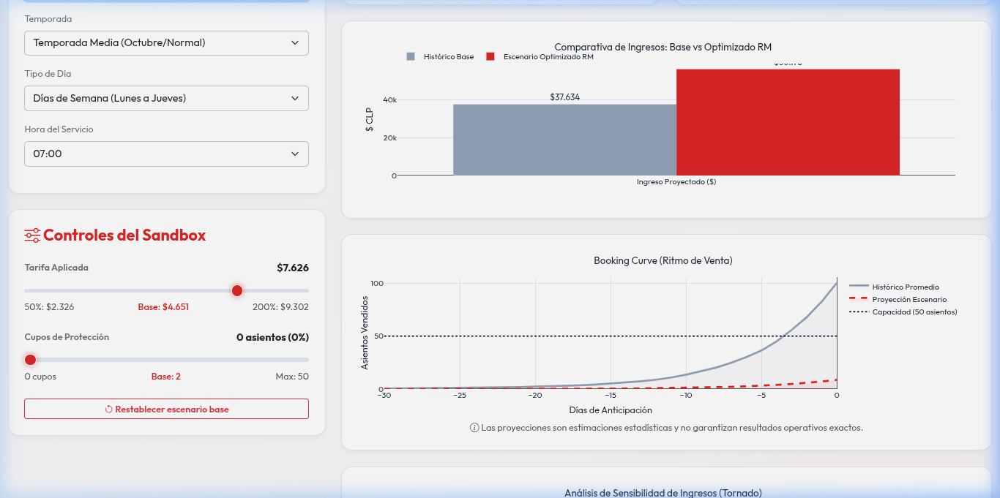
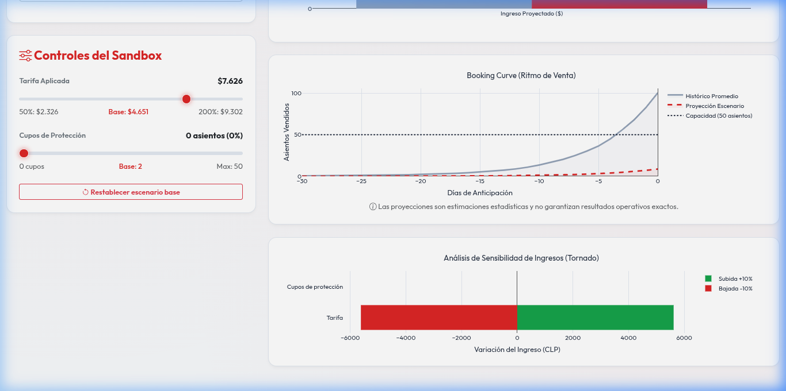
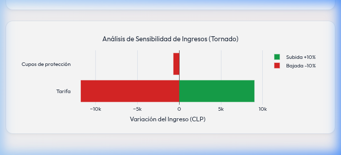
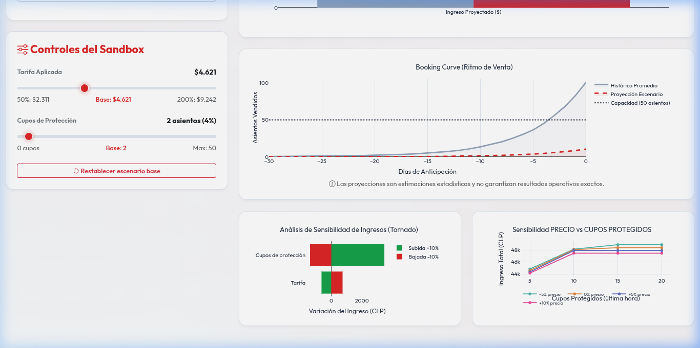

# Manual de Usuario - SimJAC V2 Revenue Sandbox

¡Bienvenido al **JAC Revenue Sandbox**! Este manual te guiará detalladamente sobre cómo utilizar el simulador comercial, qué significa cada gráfico interactivo y cómo interpretarlos con capturas de pantalla reales.

---

## 1. ¿Cómo configurar la simulación?

En el panel lateral izquierdo tienes los controles de entrada. Configura la **Ruta**, la **Temporada** (Verano, Invierno o Media) y el **Tipo de Día** (Semana o Fin de semana). 

Luego, ajusta los dos sliders clave:
* **Tarifa Aplicada ($):** Para subir o bajar el precio de los pasajes.
* **Cupos de Protección (Asientos):** Para guardar asientos para las ventas de última hora (sin descuento).

Al hacer cualquier modificación, los siguientes gráficos se actualizarán al instante:

---

## 2. Explicación Detallada de los Gráficos

### A. Gráfico 1: Comparación de Ingresos (Base vs. Optimizado RM)

Este gráfico compara los ingresos totales estimando tu nueva estrategia comercial frente al comportamiento histórico promedio.



#### Cómo interpretarlo:
* **Barra Azul/Gris ("Escenario Base"):** Representa el ingreso real que Buses JAC ha obtenido históricamente en promedio para esta ruta y horario ($CLP). Es tu punto de partida.
* **Barra Roja ("Escenario Optimizado RM"):** Representa la proyección de ingresos con la tarifa y cupos de protección que fijaste en los sliders.
* **Meta Comercial:** Tu objetivo es lograr que la **barra roja sea más alta que la barra azul**. Si es más alta, tu estrategia de Revenue Management está generando más rentabilidad que el promedio histórico.

---

### B. Gráfico 2: Curva de Ventas (Booking Curve)

Muestra la velocidad y el acumulado de venta de asientos a lo largo del tiempo, desde 30 días antes de la salida del bus (Día -30) hasta el momento de partida (Día 0).



#### Cómo interpretarlo:
* **Línea Azul Continua ("Histórico Promedio"):** Muestra el ritmo de reserva tradicional de la corrida. Sirve para saber en qué momento del mes se suele llenar el bus.
* **Línea Roja Discontinua ("Proyección Escenario"):** Es el ritmo de reserva estimado con la nueva tarifa que configuraste en el slider.
  * *Si bajas el precio:* Verás que la línea roja sube rápido y empinada hacia el tope de asientos, indicando que el bus se llenará temprano debido al descuento.
  * *Si subes el precio:* La línea roja será más plana y baja, indicando una velocidad de venta más lenta. Gracias al **modelo de elasticidad de precios**, si la tarifa es muy alta, verás que la curva termina muy abajo el Día 0 (el bus se va semi-vacío).
* **Línea de Puntos Gris ("Capacidad"):** El límite físico del bus (45 asientos). Ninguna curva puede superar esta línea.

---

### C. Gráfico 3: Análisis de Sensibilidad (Gráfico de Tornado)

Este gráfico te ayuda a entender el riesgo y el impacto marginal de tus decisiones comerciales. Mide cuánto varían tus ingresos si haces pequeños cambios en tus sliders (10% en tarifa y 10% en cupos con respecto a la capacidad del bus).



#### Cómo interpretarlo:
* **Fila "Tarifa Aplicada" (Impacto de precios):**
  * **Barra Verde (Derecha, Valor Positivo):** Muestra los ingresos extra que ganarías si **subes un 10% adicional** la tarifa seleccionada.
  * **Barra Roja (Izquierda, Valor Negativo):** Muestra el dinero que dejarías de percibir si **bajas un 10%** la tarifa seleccionada.
* **Fila "Cupos de protección" (Impacto de asientos protegidos):**
  * Muestra el impacto en el ingreso total si sumas o restas cupos a tu reserva de última hora.
* **Análisis Estratégico:** 
  * La barra más ancha es la variable más sensible. Verás que la barra de **Tarifa Aplicada** es siempre mucho más grande que la de **Cupos de protección**. Esto significa que cambiar el precio de los pasajes tiene un impacto mucho más masivo en la caja final de Buses JAC que cambiar los cupos de protección individuales.

---

### D. Gráfico 4: Sensibilidad Cruzada (Precio vs. Cupos Protegidos)

Este gráfico combina las dos decisiones críticas de Revenue Management en un mapa global de ingresos, mostrando múltiples escenarios proyectados de forma simultánea.



#### Cómo interpretarlo:
* **Eje X (Cupos Protegidos):** Evalúa el desempeño al reservar 5, 10, 15 o 20 asientos para compras de última hora.
* **Eje Y (Ingreso Total):** Muestra el resultado de caja proyectado ($CLP).
* **Las Líneas (Variaciones de Tarifa):**
  * **Verde (-5% precio):** Ingreso esperado si rebajas la tarifa actual un 5%.
  * **Naranja (0% precio):** Ingreso esperado con la tarifa que tienes seleccionada actualmente.
  * **Azul (+5% precio):** Ingreso esperado si aumentas la tarifa actual un 5%.
  * **Rosado (+10% precio):** Ingreso esperado si aumentas la tarifa actual un 10%.
* **Análisis Estratégico:**
  * **Pendiente Ascendente:** Si las líneas suben de izquierda a derecha (como en la captura), indica que **proteger más asientos aumenta el ingreso**. Esto ocurre cuando la demanda proyectada es lo suficientemente fuerte como para absorber los cupos reservados a tarifa alta de última hora.
  * **Separación de Líneas:** Te permite ver de un vistazo qué nivel de tarifa es más rentable. Si la línea rosada (+10%) o azul (+5%) está por encima de las otras, subir los precios es conveniente. Si se cruzan o la verde (-5%) queda arriba, indica alta elasticidad y es mejor vender más barato.
  * **Decisión Directa:** El equipo comercial puede ubicar el punto más alto del gráfico completo (en este caso, 20 cupos con +10% de precio) para saber instantáneamente cuál es la estrategia óptima sin necesidad de probar combinaciones una a una en los sliders.

---

## 3. Despliegue Continuo (CI/CD) en Azure VM con GitHub Actions

El proyecto está configurado para compilarse automáticamente, ejecutar pruebas de backend y desplegarse en una máquina virtual de Azure en cada push a la rama `main`.

### Requisitos en la Máquina Virtual de Azure
1. Tener **Docker** y **Docker Compose** instalados y habilitados.
2. Clonar el repositorio por primera vez en el directorio del usuario:
   ```bash
   cd ~
   git clone <URL_DE_TU_REPOSITORIO> PROYECTO_JAC
   ```

### Configuración en GitHub Secrets
Para habilitar el despliegue automático, agrega los siguientes **Secrets** en tu repositorio de GitHub (`Settings > Secrets and variables > Actions`):

* `AZURE_VM_HOST`: La IP pública o DNS de tu máquina virtual en Azure.
* `AZURE_VM_USER`: El usuario SSH de tu máquina virtual (ej. `azureuser`, `ubuntu`).
* `AZURE_VM_KEY`: La clave privada SSH (`id_rsa`) con la que accedes a la máquina virtual.
* `AZURE_VM_PORT`: (Opcional) Puerto SSH de la máquina virtual (por defecto `22`).

